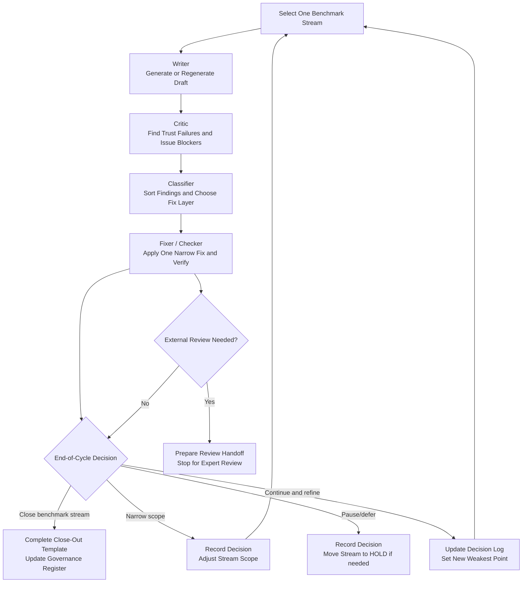

# Multi-Agent Workflow Diagram
**Safe Method Benchmark Improvement Flow**
Version: 2026-03-28

---

## Purpose

This diagram shows the recommended multi-agent flow for one benchmark-driven improvement cycle.

It is designed to make the operating order obvious:
- who goes first
- what each role produces
- where the cycle stops
- when the cycle loops

Use this alongside:
- [MULTI_AGENT_OPERATING_SYSTEM.md](C:\Users\AlanRichardson\gatekeeper\docs\MULTI_AGENT_OPERATING_SYSTEM.md)
- [LBV_ONE_CYCLE_PLAYBOOK.md](C:\Users\AlanRichardson\gatekeeper\docs\LBV_ONE_CYCLE_PLAYBOOK.md)

---

## Core Flow

---

## Short Role Summary

### Writer
- produces the draft
- stays close to source
- exposes uncertainty

### Critic
- identifies trust drops
- identifies issue blockers
- compares draft to source

### Classifier
- separates reusable rules from case-specific fixes
- identifies issue-gate candidates
- decides likely fix layer

### Fixer / Checker
- applies one narrow fix
- regenerates/tests/checks
- recommends stop/go outcome

### Optional Coordinator
- selects stream priority
- keeps one active weakness at a time
- enforces stop rules

---

## Stop Points

The cycle should stop when:
- external consultant review is the next right step
- the benchmark is materially satisfied
- the next gap is architectural, not incremental
- the loop is becoming low-value churn

Do not let the agents loop without a decision.

---

## Practical Rule

**One cycle = one stream = one main weakness**

That is what keeps the system efficient and clean.

---

## Related Documents

- [MULTI_AGENT_OPERATING_SYSTEM.md](C:\Users\AlanRichardson\gatekeeper\docs\MULTI_AGENT_OPERATING_SYSTEM.md)
- [LBV_ONE_CYCLE_PLAYBOOK.md](C:\Users\AlanRichardson\gatekeeper\docs\LBV_ONE_CYCLE_PLAYBOOK.md)
- [BENCHMARK_GOVERNANCE_REGISTER.md](C:\Users\AlanRichardson\gatekeeper\docs\BENCHMARK_GOVERNANCE_REGISTER.md)

