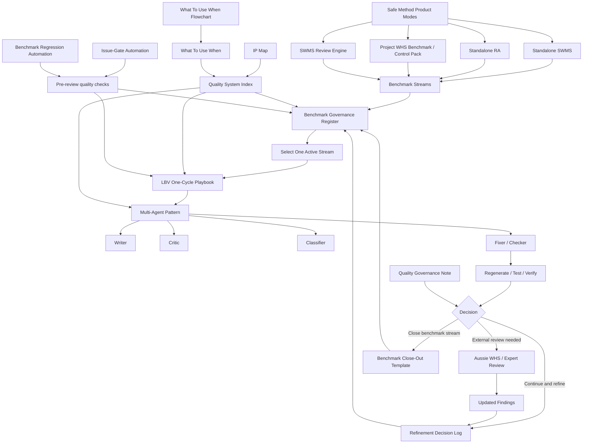

# Safe Method Quality System Map
**High-Level Visual Overview**
Version: 2026-03-28

---

## Purpose

This diagram shows the full Safe Method quality system at a high level.

It connects:
- product modes
- benchmark governance
- LBV cycles
- multi-agent operation
- expert review
- automation
- decision logging

Use this when you want one visual explanation of how the whole system fits together.

---

## High-Level Map

---

## Plain-English Reading Guide

### 1. Product modes exist first

Safe Method has multiple product modes:
- SWMS
- RA
- Project WHS benchmark / control pack
- SWMS Review Engine

### 2. Each mode is improved through benchmark streams

Benchmark streams are tracked in the governance register.

### 3. Each stream is worked one cycle at a time

The LBV cycle is:
- pick one stream
- pick one weakest point
- run one clean cycle

### 4. Multi-agent operation is inside the cycle

The normal role pattern is:
- writer
- critic
- classifier
- fixer/checker

### 5. Decisions update governance

A cycle ends in:
- continue and refine
- external review
- close benchmark stream

### 6. Automation sits around the cycle

Automation does not replace the system.
It enforces:
- issue gates
- regression checks

---

## Related Documents

- [QUALITY_SYSTEM_INDEX.md](C:\Users\AlanRichardson\gatekeeper\docs\QUALITY_SYSTEM_INDEX.md)
- [WHAT_TO_USE_WHEN.md](C:\Users\AlanRichardson\gatekeeper\docs\WHAT_TO_USE_WHEN.md)
- [LBV_FLYWHEEL_ARCHITECTURE.md](C:\Users\AlanRichardson\gatekeeper\docs\LBV_FLYWHEEL_ARCHITECTURE.md)
- [MULTI_AGENT_OPERATING_SYSTEM.md](C:\Users\AlanRichardson\gatekeeper\docs\MULTI_AGENT_OPERATING_SYSTEM.md)

