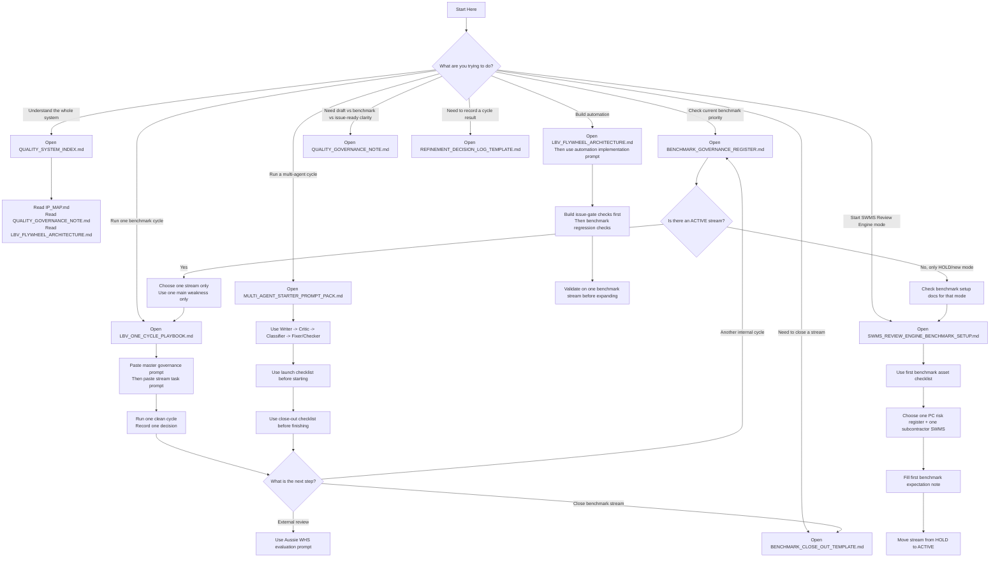

# What To Use When Flowchart
**Visual Guide for Safe Method Quality Work**
Version: 2026-03-28

---

## Purpose

This flowchart turns the Safe Method quality-system docs into a quick visual path.

Use it when you want to decide:
- which document to open
- which workflow to run
- whether to use benchmark mode, multi-agent mode, automation work, or the SWMS Review Engine setup

---

## Flowchart

---

## Short Use Guide

### If you are unsure where to start

1. Open [BENCHMARK_GOVERNANCE_REGISTER.md](C:\Users\AlanRichardson\gatekeeper\docs\BENCHMARK_GOVERNANCE_REGISTER.md)
2. Pick one active stream
3. Open [MULTI_AGENT_STARTER_PROMPT_PACK.md](C:\Users\AlanRichardson\gatekeeper\docs\MULTI_AGENT_STARTER_PROMPT_PACK.md)
4. Run one clean cycle

### If there is no active stream

1. Open the relevant benchmark setup doc
2. gather the first benchmark assets
3. define the first expectation note
4. activate the stream

### If the next step is not clear

Open [WHAT_TO_USE_WHEN.md](C:\Users\AlanRichardson\gatekeeper\docs\WHAT_TO_USE_WHEN.md)

---

## Related Documents

- [WHAT_TO_USE_WHEN.md](C:\Users\AlanRichardson\gatekeeper\docs\WHAT_TO_USE_WHEN.md)
- [QUALITY_SYSTEM_INDEX.md](C:\Users\AlanRichardson\gatekeeper\docs\QUALITY_SYSTEM_INDEX.md)
- [MULTI_AGENT_STARTER_PROMPT_PACK.md](C:\Users\AlanRichardson\gatekeeper\docs\MULTI_AGENT_STARTER_PROMPT_PACK.md)
- [SWMS_REVIEW_ENGINE_BENCHMARK_SETUP.md](C:\Users\AlanRichardson\gatekeeper\docs\SWMS_REVIEW_ENGINE_BENCHMARK_SETUP.md)

